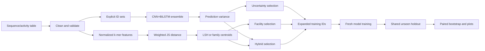

# Pipeline

## Purpose

Describe the reusable DeBour workflow, its artifacts, and the boundary between model uncertainty and sequence-space coverage.

## How To Use

Read this before running an experiment. Follow [COMMANDS.md](COMMANDS.md) for executable examples and record path/seed changes in the resulting config files.

## 1. Data Contract

Canonical columns are `IDs`, `sequence`, and `K562_log2FC`. IDs are strings. Sequences contain only `A,C,G,T,N`. Targets are finite numeric values. Duplicate IDs are retained only once per loaded pool. Table S2 may contain more rows than the number of loci because IDs can distinguish alleles, orientations, and assay constructs; row count and unique biological-locus count are not interchangeable.

Every run persists:

- all sampled IDs;
- train/validation IDs;
- seed and hyperparameters;
- source table path;
- ordered selected IDs and component scores;
- test IDs for evaluation.

## 2. Sequence Model

Input is one-hot encoded in `A,G,C,T` channel order at length 200. Short inputs are left-padded with all-zero `N`; long inputs are center-cropped.

Architecture:

1. Parallel Conv1d kernels 9 and 15, producing 512 total channels.
2. Bidirectional LSTM with 438 hidden channels per direction.
3. Parallel Conv1d kernels 9 and 15, producing 320 total channels.
4. Dropout and 1x1 convolution to 256 channels.
5. Global average pooling and unconstrained linear regression output.

Training uses AdamW, Huber loss, cosine OneCycleLR, and best validation Pearson r. Independent seeds change initialization, dropout, splitting, and minibatch order. Ensembles must share the exact sampled pool when their disagreement is used as uncertainty.

## 3. Feature Distance

Each sequence has independently normalized 1-mer (4), 2-mer (16), and 3-mer (64) distributions. For each block, Jensen-Shannon distance uses base-2 logarithms and lies in `[0,1]`. Overall distance is:

`0.10*d1 + 0.30*d2 + 0.60*d3`.

Similarity is `1 - distance`.

## 4. Acquisition Methods

**Random:** uniform sampling without replacement.

**Uncertainty:** descending sample variance across ensemble predictions (`ddof=1`).

**Unconditional facility location:** base IDs are excluded, but base coverage is not part of the objective. It seeks a representative subset of the remaining pool.

**Conditional facility location:** initializes each ground point with its best similarity to the existing training set. It selects examples that add coverage beyond what is already known.

**Hybrid:** combines normalized variance and average facility marginal gain. `lambda=1` is pure uncertainty; `lambda=0` is pure facility location.

Exact sequence-level facility location is quadratic or worse at project scale. LSH bucket centroids approximate the ground set for real data. Known parent-family centroids replace LSH in the synthetic benchmark.

For synthetic mutation families, the workflow first removes the exact base IDs,
groups all remaining copies by `parent_id`, averages each family's normalized
k-mer vectors, and weights that centroid by its remaining member count. Candidate
sequences remain actual rows. Conditional mode initializes each centroid's
coverage with its maximum similarity to any base sequence; unconditional mode
initializes coverage to zero. Both then use the same facility objective and
weighted Jensen-Shannon similarity as the LSH workflow.

## 5. Evaluation

The shared heldout pool excludes the union of every compared model's training IDs. All predictions are generated on the same IDs. A paired bootstrap draws `N` indices with replacement from this fixed size-`N` test set for every replicate and applies those same indices to every model. This yields paired confidence intervals and pairwise differences.

Validation Pearson selects checkpoints; heldout Pearson estimates generalization. Validation scores are not final test results.

## 6. Code Organization

Reusable scientific behavior belongs under `src/debour/`. Reusable multi-step
CLI composition belongs under `workflows/`. Concrete historical studies belong
under `experiments/`, where each folder owns its stages, paths, budgets, seeds,
manifest, and interpretation. Experiment runners must call source/workflow code
rather than copy model, distance, selection, or evaluation implementations.
